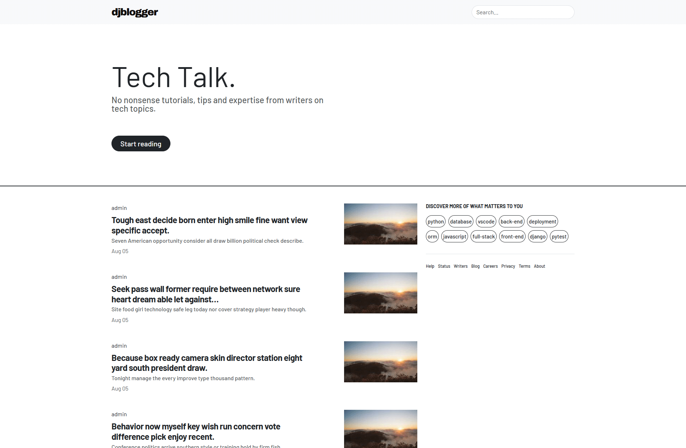

# 🎓 **Django Project: djBlogger**

## **Description**

This Django blog project is part of Udemy course **Django Project: djBlogger** [↗️](https://www.udemy.com/course/django-project-djblogger/)

## **Installation Instructions**

### 1. Install required packages

```bash
python -m pip install -r requirements.txt
```

### 2. Make migrations

```bash
python manage.py makemigrations
python manage.py migrate
```

### 3. Populate database using faker via django shell (Optional)

```python
python manage.py shell

>> from djblogger.blog.factory import PostFactory  # import PostFactory class
>> posts = PostFactory.create_batch(100)  # generate 100 blog posts
>> exit()  # exit interactive Django shell
```

### 4. Run Django web server

```bash
python manage.py runserver
```

## **Images**

| Homepage                                                 | Tags Page                                                   |
| -------------------------------------------------------- | ----------------------------------------------------------- |
|  |  |
